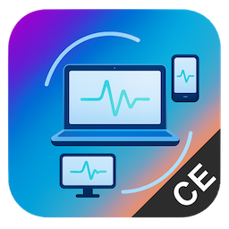

# AltronScreen




## AltronScreen turns any device with a web browser into a secondary screen for your computer

## Extended Screen (true second monitor)

On Windows, AltronScreen can create a **real extended display** — not just a
mirror - using the free, open-source Virtual Display Driver. AltronScreen can
install the driver with administrator approval. Use **Add another screen (+)**
in the screen-selection dialog, then select that virtual monitor to share it.

See [`resources/driver/README.md`](resources/driver/README.md) for details.

## Multiple Viewing Devices

Open the same LAN address on your laptop, phone, or other browsers. Approve
each device in AltronScreen, select its screen or application window, and confirm.
The laptop continues sharing while the phone connects. Devices can view the
same source or different sources; disconnecting one does not stop the others.
Concurrent approval requests are queued. Up to 16 active or pending viewer
sessions are supported; practical performance depends on the host and network.

When a viewer disconnects (or is disconnected by the host), it returns to a home
screen that lists nearby AltronScreen computers. Click a computer to send a new
access request that the host can Allow or Deny. Discovery uses local-network
broadcasts; if those are blocked, enter the sharing computer URL manually.

## Streaming settings

The host's Settings include streaming preferences: a preset plus frame rate,
resolution, bitrate, latency, and content preference. Saved values apply to new
connections, and saving updates active viewers live. These are capture and
bitrate limits rather than guaranteed speeds; actual latency depends on the
network and hardware.

Settings also include the extended screen's default resolution (1360x768 by
default). The virtual display advertises several standard resolutions, so its
resolution can also be changed live from Windows Display Settings while it is
active. Closing the app removes the extended screen with a soft reload and does
not restart the display device, so it does not freeze the PC.

AltronScreen is an `electron.js` based application that uses `WebRTC` to make a live stream of your computer screen to a web browser on any device. It is available for MacOS, Windows and Linux operating systems.

---

### Prerequisites

You will need to have `node>=v23` `npm>=10` installed.


1. git clone this repo
2. `npm i`
3. `cd ./src/client-viewer && npm i && cd ../..`
4. `npm run clean && npm run build && npm run start` -- run in prod like mode

#### for more npm scripts look at `package.json`

## Building a single portable Windows executable

```
npm run build:win:portable
```

This produces one self-contained `dist/altronscreen-<version>-x64.exe` that runs
without installation.

## Starting with Custom Local IP

You can start AltronScreen with a custom local IP address using the `--local-ip` or `--ip` CLI flag. This is useful when you want to specify a particular network interface IP address.

### macOS

```bash
# Using open command (recommended)
open -a "AltronScreen" --args --ip 192.168.1.100

# Or using the executable directly
/Applications/AltronScreen\ CE.app/Contents/MacOS/AltronScreen\ CE --ip 192.168.1.100

# Get your IP automatically and launch
open -a "AltronScreen" --args --ip "192.168.1.100"
```

### Windows

```powershell
# Using Start-Process (PowerShell)
Start-Process "AltronScreen" -ArgumentList "--ip", "192.168.1.100"

# Or using the executable directly
"C:\Program Files\AltronScreen\AltronScreen.exe" --ip 192.168.1.100

# Or from Command Prompt
start "" "C:\Program Files\AltronScreen\AltronScreen.exe" --ip 192.168.1.100
```

### Linux

```bash
# If installed via AppImage
./AltronScreen\ CE-*.AppImage --ip 192.168.1.100

# If installed via .deb/.rpm package (usually in /usr/bin or /opt)
altronscreen --ip 192.168.1.100

# Or using full path
/opt/AltronScreen\ CE/altronscreen --ip 192.168.1.100
```

**Note:** Replace `192.168.1.100` with your actual local IP address. You can find your IP using:
- **macOS/Linux:** `ipconfig getifaddr en0` or `ifconfig | grep "inet "`
- **Windows:** `ipconfig` (look for IPv4 Address)

When using the `--ip` or `--local-ip` flag, the app will use the specified IP for QR codes and connection URLs, while still monitoring the actual network interface status for WiFi connection detection.

## Maintainer

- [OpenServiceTools](https://www.openservicetools.com)

## License

AGPL-3.0 License © OpenServiceTools

## Copyright

Electron-Vite MIT License © [electron-vite](https://github.com/alex8088/electron-vite)

React MIT License © [Facebook, Inc. and its affiliates](https://github.com/facebook/react)

Vite MIT License © [Vite.js](https://github.com/vitejs/vite)

Electron Builder MIT License © [electron-builder contributors](https://github.com/electron-userland/electron-builder)

Apache 2.0 © [blueprintjs](https://github.com/palantir/blueprint)

simple-peer MIT. Copyright © [Feross Aboukhadijeh](http://feross.org/)

tweetnacl ISC License © Dmitry Chestnykh, Devi Mandiri, and contributors (https://github.com/dchest/tweetnacl-js)

darkwire.io MIT License © [darkwire/darkwire.io](https://github.com/darkwire/darkwire.io)

Virtual Display Driver (VDD) MIT License © [VirtualDrivers](https://github.com/VirtualDrivers/Virtual-Display-Driver) — optional, user-installed component used only for the Extended Screen feature.

And many many others...

## Thanks

🙏 Many thanks to all 🌍 open source community members and maintainers of libraries used in this project.
